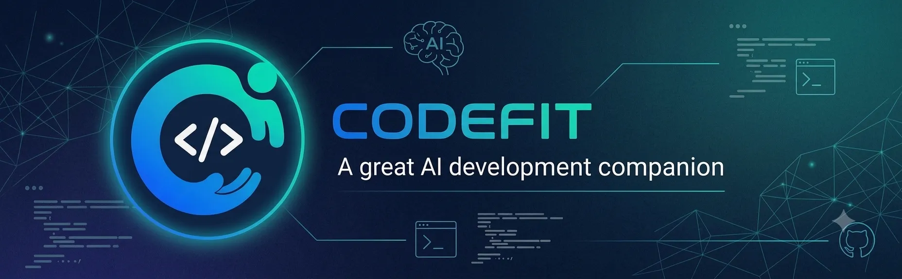
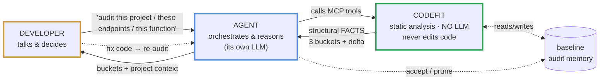
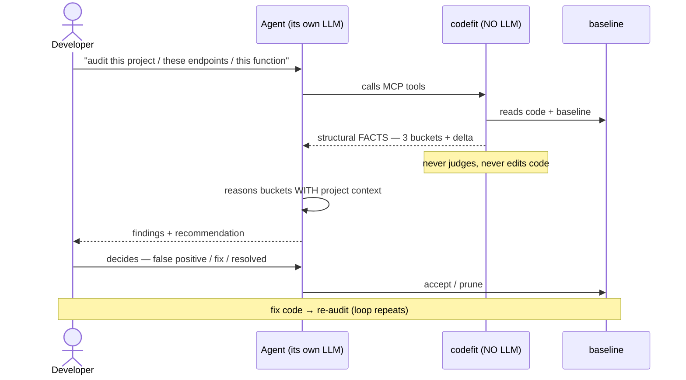

# codefit

[](https://github.com/codefit-cli/codefit/actions/workflows/ci.yml)
[](LICENSE)

> **The MCP-first auditor for AI-generated code — codefit maps, the agent reasons.**

codefit is an open-source tool, written in Go, that audits software written
(partly or fully) by AI. It detects what a developer **never sees** during normal
development: security vulnerabilities, algorithmic complexity that scales badly,
structural database problems, regression risk, and quality issues that only
surface under deep review. Its guiding principle: *codefit audits what the
developer is never going to see* — if a dimension is visible during normal
development, it is out of scope.

## How it works — a collaborative loop, not a linter dump

codefit is not a tool that prints a list of findings. It is one side of a loop
between you, your agent, and codefit — each with a distinct job. **codefit reads
and analyzes (no LLM, never edits code); your agent reasons with its own LLM; you
decide.**

**The three roles — who does what.** Each color marks a role; you will see the
same colors again in the loop below.



The boundary is the whole point: **codefit never calls an LLM.** It runs the
deterministic layers (patterns + AST), maps the structural *surface* of the
classes that need reasoning, and returns **facts** ("reads `params.id`", "no known
authz helper in the body") — never a verdict. The agent you already use supplies
the intelligence, reasoning each item with the project's context. That is what
democratizes auditing: anyone already coding with AI can audit without extra API
keys or infrastructure.

**One full pass through the loop.** Same actors, same order as above — the
developer asks, the agent orchestrates, codefit reports facts, the developer
decides, and a fix re-enters the loop.



## What problem it solves (and what it is NOT)

The agent generates code that **passes the tests** and **meets the visible
criteria**. Nobody sees the rest: a missing ownership check on an endpoint, a model
serialized with every column to the client, a hash that is weak for security, an
index that only hurts at scale. codefit audits exactly that invisible layer.

It **complements** linters and type-checkers — it does not replace them. An unused
`any`, a style nit, an obvious type error are visible during normal development, so
a linter already catches them and they are **out of scope**. codefit is the
independent audit layer that validates AI-generated code is secure and correct
**before** it merges.

## Status — Phase 2 (the database dimension), OLAP closed

**Works today, on `main`, validated in real use against real backends:**

- **Providers:** TypeScript (gotreesitter, pure Go) and Go (`go/ast`, used for the
  CI self-audit).
- **Deterministic security rules (TypeScript)** — five categories, each a fact at
  certainty 1.0 (see [COVERAGE.md](COVERAGE.md)).
- **Surface mapping** — three categories (IDOR, broken authorization,
  over-fetching) for Next.js (App Router + Server Actions), **Express, Fastify, and
  NestJS**, enumerated completely for the agent to reason. Resource access in another
  file is signalled (`indirect_access`), not followed across files.
- **`scan-all` three-bucket synthesis** + on-demand `scan-endpoint` detail.
- **Baseline** — a committed, content-addressed memory of the audited surface, with
  `baseline-list` / `-accept` / `-prune`, so a re-scan only surfaces what changed.
- **Scoping a scan to the files you changed** — an optional `changed_files` on
  `codefit-scan-all` / `codefit-scan-security`, with the narrowing declared in the
  response so a partial result never reads as a full one (see
  [Scoping a scan](#scoping-a-scan-to-the-files-you-changed) below). Exercised over four
  real TypeScript projects by a committed dogfood harness — the narrowing kept its whole-project
  denominator, left nothing unmatched, and reached the same verdict on those files as a full
  pass — though through the security sensor rather than the MCP handler; see
  [What has actually been measured](#what-has-actually-been-measured).
- **An opt-in content-hash finding cache** — the same codefit binary, over the same file
  bytes at the same path, reuses the analysis instead of recomputing it, so a recurring full
  scan costs about what an incremental one does. Off unless a project enables it, and a warm
  scan is byte-identical to a cold one (see [The finding cache](#the-finding-cache-opt-in)
  below). Exercised over the same four real projects: warm scans re-analysed **0 files** and
  came out byte-identical to cold. The timings that came with it are a measurement on one
  machine, not a speed codefit promises — read them, with their limits, under
  [What has actually been measured](#what-has-actually-been-measured).
- **`codefit init`** — detects the stack, writes `.codefit.yaml`, and installs
  codefit's own thin skill for each detected agent.
- **MCP stdio server** (official MCP Go SDK), single static binary, `CGO_ENABLED=0`.
- **Database-dimension auditing** — a neutral schema model with two schema parsers,
  **Prisma** (`schema.prisma`) and **SQL-DDL** (Flyway migrations, reconstructed
  incrementally), the latter supporting **PostgreSQL, MySQL, and SQL Server (T-SQL)**
  dialects selected by `database.type` in `.codefit.yaml` (`postgresql` | `mysql` |
  `sqlserver`; `sqlite` returns an explicit "not supported yet" note). It audits, all
  dialect-agnostic over the neutral schema: the schema's **structural quality** (keys,
  indexes, column shape, name-heuristic smells), **view** sensitive-column exposure,
  the **routine bodies** of stored procedures, functions, and triggers (dynamic SQL,
  missing exception handling, cross-table cascades, external-effecting calls), and
  **code×schema crosses** that check whether the columns the code actually filters on
  are backed by an index. It also **detects the schema's paradigm** (OLTP vs OLAP,
  overridable by `database.paradigm`) so an OLAP schema's intentional denormalization
  is not flagged as a normalization violation — the whole **schema** is judged before
  any table is called a fact or a dimension, so one `dim_`-named table cannot silence
  its own normalization findings inside an otherwise transactional schema — and on a
  schema it classifies as a
  warehouse it audits the **star-schema and slowly-changing-dimension shape** (a fact
  joining no dimension, a business key where a surrogate belongs, facts with no time
  dimension, an SCD-2 currency lookup no index serves, SCD-1 and SCD-2 mixed), a
  **fact table with no columnar/analytic index**, and a **census of its fact tables for
  declared table partitioning** — seven DW rules in all, with no OLAP rule left unbuilt.
  One structural fact is
  affirmed (a table with no primary key); everything else is surface the agent reasons.
  Run it standalone with `codefit-scan-db`; it also runs inside `scan-all` as its own
  section with a per-dimension score (the code×schema cross runs in `scan-all` only).
  The rule inventory lives in [COVERAGE.md](COVERAGE.md).
  Dogfooded on real Prisma and SQL-DDL (Postgres/MySQL/T-SQL) backends.

**The Phase-2 acceptance criterion is met.** The PRD asks for `codefit-scan-db` to
produce *verified real findings on a real project*. Measured on `main` through the
real handler, over an untouched UTF-16LE `pg_dump` of a production Postgres backend:
`measured: true`, 9 tables, structure proven for 9 of 9, **12 surface items, 0
deterministic findings**, paradigm `oltp`. Every one of the 12 was hand-checked
against the DDL — **0 false positives** — and the run also holds a verified *true
negative*: the schema declares 11 foreign keys and the FK rule fires on 10, staying
correctly silent on the eleventh, whose column a `UNIQUE` constraint already covers.
Read the number honestly, though: that project exercises a **narrow slice** — 9
tables, no views, procedures or triggers, nothing analytic — so only **3 of the 21
DB/DW rules fired at all**; breadth is evidenced by the 26-corpus survey, not by this
one project. And its `score` is **100** *alongside* those 12 items, which is correct
by design (surface is a question for the agent, so it is never scored) but reads as
"clean" to anyone who looks at the score first.

**On the roadmap (not yet in `main`):** the HTTP/SSE transport;
**literal values in the query model** — carrying the WHERE's literals so the
cross can infer cardinality from usage (a `String` used as an enum, a `DateTime` used
as a flag) and tell an equality filter from a range, the two field-observed limits of
the index-vs-query cross; Phase 3 code review / best practices / tests; Phase 4
knowledge packs + `update`.
See the [PRD](docs/PRD-codefit-v1.4.md) §25 and [VERSIONING.md](VERSIONING.md).

## What codefit covers today

Concretely, on `main` — so you know exactly what to expect without reading
[COVERAGE.md](COVERAGE.md) in full:

- **Languages.** TypeScript / TSX (full rules + surface) and Go (the CI self-audit).
- **Deterministic rules (TypeScript, certainty 1.0).** Hardcoded secrets, weak
  crypto (MD5/SHA-1, insecure `Math.random` for tokens), dangerous
  `eval`/`new Function`, inline SQL injection, and inline XSS via
  `dangerouslySetInnerHTML` (React-specific by its pattern). These run on **any**
  `.ts`/`.tsx` file — no framework gate; which ones fire depends on the code, not the
  framework.
- **Surface mapping — the agent reasons.** IDOR, broken authorization,
  over-fetching, and the **N+1 query-in-loop** pattern (DB-201), for **Next.js** (App
  Router route handlers + Server Actions), **Express**, **Fastify**, and **NestJS**.
  Handlers are found by structural shape,
  never by path or name. When a handler reaches a resource through a service in
  another file, codefit flags it (`indirect_access`) and names the call — it does not
  follow it across files; the agent does. N+1 items are **ordered, never filtered**: a
  loop over a literal 3-element array is enumerated exactly like one over an unbounded
  query result, with the iterated source named as a fact so the agent dismisses it at a
  glance.
- **Dependency CVEs.** `codefit-check-cves` checks dependencies against
  [OSV.dev](https://osv.dev) (free, no API key) using the **exact** versions from
  `package-lock.json` / `go.mod` — never guessed from `package.json` ranges (no
  lockfile → an honest note, not a guess). codefit keeps no vuln DB of its own and
  surfaces OSV's severity rather than recomputing CVSS.
- **Database dimension — the agent reasons the surface.** Read from
  `database.schema_paths` (a Prisma `schema.prisma` or a directory of SQL-DDL / Flyway
  migrations reconstructed to the final schema). SQL-DDL parsing supports **three
  dialects**, selected by `database.type` in `.codefit.yaml`:

  ```yaml
  database:
    type: postgresql # postgresql | mysql | sqlserver (sqlite: not supported yet)
    paradigm: auto   # auto (default) | oltp | olap | mixed — codefit detects when unset; an explicit value wins
    schema_paths:
      - db/migrations
  ```

  codefit audits the schema's **structural quality** (keys, indexes, column shape, and
  name-heuristic smells), **view** sensitive-column exposure, the **routine bodies** of
  stored procedures, functions, and triggers (dynamic SQL, missing exception handling,
  cross-table cascades, external-effecting calls), and — in `scan-all` — **crosses the
  code's Prisma queries against the schema** to see whether the columns the code filters
  on are backed by an index. One structural fact is affirmed (a table with no primary
  key); everything else is surface the agent judges, all dialect-agnostic over the
  reconstructed neutral schema. codefit also **detects the schema's paradigm** (OLTP vs
  OLAP — `database.paradigm` overrides it) and does **not**
  flag an OLAP schema's intentional denormalization as a normalization violation. The
  question is asked of the **schema** before it is asked of any table: a schema counts as
  a warehouse only on schema-wide evidence (a declared calendar table, the `_sk`
  surrogate-key convention, or a numeric/text split across its column types), and inside
  a schema that shows none of those, no table gets a warehouse role at all — so one
  `dim_`-named table cannot decide its own silencing. When roles are withheld, the scan's
  note says so and names `database.paradigm: olap` as the escape hatch. On a
  schema it classifies as a warehouse it additionally audits the **star-schema and
  slowly-changing-dimension shape**: a fact table joining no dimension, a dimension keyed
  by a business key instead of a surrogate, facts with no time dimension, an SCD-2
  dimension whose "current version" lookup no index serves, and SCD-1 and SCD-2
  dimensions mixed in one schema — plus a **fact table with no columnar/analytic index**
  (a `brin` or `columnstore` method the parser read from the DDL; a fact table with only
  ordinary row-store indexes fires) and a **census of its fact tables for declared table
  partitioning** (one item for the whole schema, never one per table, naming which fact
  tables declare partitioning and which do not; declared partition children are excluded,
  since a partition is not a fact table). All seven are surface, never affirmations —
  whether a fact table is large enough to need partitioning or a columnar index is a
  runtime fact codefit cannot see, so it hands the agent the shape and the question.
  Table roles are recognized from the table **name**,
  **case-insensitively**, in three spellings: an underscore-delimited leading segment
  (`fact_`/`fct_`/`f_`, `dim_`/`d_`, `stg_`, `mart_`), an underscore-delimited trailing
  segment (`_fact`/`_facts`, `_dim`/`_dims`), or separator-free **PascalCase**
  (`FactInternetSales`, `DimCustomer`). A recognized name is only ever a *candidate* —
  real relational structure must corroborate it before a table is promoted. Declared
  limit: an **all-caps** name (`FACTORY_SETTINGS`) stays unclassified by design, as does
  a name with neither a delimiter nor a PascalCase boundary. See
  [COVERAGE.md](COVERAGE.md) for the full rule inventory and the declared SQL-DDL
  dialect limits.
- **Not covered (declared, not silent).** JS server frameworks beyond
  Next.js/Express/Fastify/NestJS; deep taint analysis; business-logic correctness;
  architectural and race-condition classes. An Express/Fastify handler passed by
  reference (not inline) is not enumerated. Full list and limits in
  [COVERAGE.md](COVERAGE.md).

## Install

Two ways to install. **Option A (the release binary) is recommended** — it reports the
correct version and needs no Go toolchain.

### Option A — download the release binary (recommended)

Grab the archive for your platform from the
[latest release](https://github.com/codefit-cli/codefit/releases/latest). This is the
tagged build, so `codefit version` reports the real version, and it needs no Go.

**Linux / macOS** (pick your target: `linux_amd64`, `linux_arm64`, `darwin_arm64`):

```bash
tar -xzf codefit_<version>_linux_amd64.tar.gz
sudo mv codefit /usr/local/bin/        # a directory on your PATH
chmod +x /usr/local/bin/codefit
```

**Windows** (`windows_amd64`): download `codefit_<version>_windows_amd64.zip`, extract it,
and put `codefit.exe` in a stable folder (e.g. `C:\tools\codefit\`). Optionally add
that folder to your `PATH`.

Verify the download against `checksums.txt` from the release —
`sha256sum -c checksums.txt` (Linux), `shasum -a 256 -c checksums.txt` (macOS), or
`Get-FileHash codefit_<version>_windows_amd64.zip -Algorithm SHA256` (Windows PowerShell).

### Option B — `go install` (needs Go 1.25+)

```bash
go install github.com/codefit-cli/codefit/cmd/codefit@latest
```

Heads up: this reports its version as `0.1.0-dev (commit none, built unknown)` because
`go install` does not embed release metadata — the version is injected by ldflags only
in the release build (GoReleaser) and in `make build`. The binary is **functionally
identical** to the release. For the tagged version, download from
[Releases](https://github.com/codefit-cli/codefit/releases/latest) or build from a
checkout with `make build`.

### Verify the install

```bash
codefit version
# example output — your version, commit, and date will differ:
# release binary →  codefit <version> (commit <commit>, built <date>)
# go install     →  codefit v0.1.0-dev (commit none, built unknown)
```

A single static binary, no runtime dependencies (`CGO_ENABLED=0`), cross-compiling
to linux/amd64, linux/arm64, windows/amd64, darwin/arm64. There is no LLM or auth
to configure — codefit manages no models and no credentials.

## Quickstart

```bash
# 1. In your project, generate config + install codefit's skill for your agent(s)
codefit init

# 2. Register codefit as an MCP server for your agent (see "Connect codefit" below)

# 3. From your agent, in plain language:
#    "audit the endpoints in this project for IDOR and broken authorization"
```

The agent loads codefit's skill, calls `codefit-scan-all`, reads the three buckets
(every endpoint named with what it takes to rank it), pulls the full concerns of the
ones worth pursuing with `codefit-scan-endpoint`, reasons the surface with your
project's context, and reports back. When you decide
an item is a false positive it calls `codefit-baseline-accept` with your reason;
after a fix it calls `codefit-baseline-prune`. You never leave the agent, and
codefit never touches your code.

## Connect codefit

Register codefit as a local (stdio) MCP server. The config blocks need the **absolute
path** to the binary unless it is on the agent process's `PATH`. codefit is stateless —
the project root is passed per call as the `root` tool argument, so the server needs no
`cwd`.

### Finding the binary path

**Linux / macOS:**

```bash
which codefit                        # if it's on your PATH
echo "$(go env GOPATH)/bin/codefit"  # if you used `go install`
```

**Windows (PowerShell):**

```powershell
where.exe codefit                    # if it's on your PATH
Write-Output "$(go env GOPATH)\bin\codefit.exe"   # if you used `go install`
```

With the release binary, the path is wherever you placed it (e.g.
`C:\tools\codefit\codefit.exe`).

> **Windows path gotcha (this is the one that bites):** in JSON (`.mcp.json`,
> `opencode.json`) a Windows path must use **double backslashes**
> (`"C:\\Users\\you\\go\\bin\\codefit.exe"`) or **forward slashes**
> (`"C:/Users/you/go/bin/codefit.exe"`). A single backslash is an invalid JSON escape
> and silently breaks the config. The same applies to TOML basic strings (Codex), or
> use a single-quoted literal string there: `'C:\Users\you\go\bin\codefit.exe'`.

In every Windows example below, **replace `you` with your Windows username** and point
the path at wherever codefit actually lives.

**Claude Code** — `.mcp.json` (project) or `claude mcp add`:

Linux / macOS:

```json
{
  "mcpServers": {
    "codefit": { "type": "stdio", "command": "/usr/local/bin/codefit", "args": ["mcp", "serve"] }
  }
}
```

Windows:

```json
{
  "mcpServers": {
    "codefit": { "type": "stdio", "command": "C:\\Users\\you\\go\\bin\\codefit.exe", "args": ["mcp", "serve"] }
  }
}
```

**OpenCode** — `opencode.json`:

Linux / macOS:

```json
{
  "mcp": {
    "codefit": { "type": "local", "command": ["/usr/local/bin/codefit", "mcp", "serve"], "enabled": true }
  }
}
```

Windows:

```json
{
  "mcp": {
    "codefit": { "type": "local", "command": ["C:\\Users\\you\\go\\bin\\codefit.exe", "mcp", "serve"], "enabled": true }
  }
}
```

**Codex** — `~/.codex/config.toml`:

Linux / macOS:

```toml
[mcp_servers.codefit]
command = "/usr/local/bin/codefit"
args = ["mcp", "serve"]
```

Windows (single-quoted literal string — no backslash escaping needed):

```toml
[mcp_servers.codefit]
command = 'C:\Users\you\go\bin\codefit.exe'
args = ["mcp", "serve"]
```

Then run `codefit init` in the project. It detects Codex by a **project-local
`.codex/`** dir (not the global config); if Codex is only configured globally,
`init` writes the skill to the standard `.agents/skills/codefit/` location and
tells you so.

## The tools

codefit exposes its capabilities as MCP tools in three roles:

**The engine** — run the analysis and read the result.

| Tool | What it does |
| --- | --- |
| `codefit-scan-all` | The per-endpoint synthesis: three buckets (`actionable` / `resolved_clean` / `frontier_pending`) + the baseline delta, plus a parallel `db` section (database-structure findings/surface) and a per-dimension `score`. Every bucket **names** its endpoints with what it takes to rank them; the concern text is fetched on demand (deterministic findings come back in full). Carries a declared byte `budget` and says how many endpoints it withheld, if any. The main entry point. Optional `changed_files` narrows the audit — see [Scoping a scan](#scoping-a-scan-to-the-files-you-changed). |
| `codefit-scan-endpoint` | Full detail of one file on demand — the concerns `scan-all` named but did not spell out, for **any** bucket. |
| `codefit-scan-security` | The deterministic findings + mapped surface over a project (the flat result). Also takes the optional `changed_files`. |
| `codefit-scan-db` | The database-structure audit over the configured schema (`database.schema_paths` — a Prisma `schema.prisma` or SQL-DDL migrations in PostgreSQL, MySQL, or SQL Server dialect per `database.type`): affirmations (e.g. a table with no primary key) + surface (un-indexed FKs, duplicate indexes, …). Returns `measured: false` with a note when there is no schema or parser — and equally when every configured schema source was found but none of them could be read, so an unreadable schema is never reported as a clean one. |
| `codefit-surface-idor` / `-authz` / `-overfetch` | Enumerate one surface category for the agent to reason. |
| `codefit-surface-nplus1` | Enumerate the N+1 surface: query call sites sitting inside a loop, ordered by structural certainty (the cross-function frontier last, never dropped). |
| `codefit-check-cves` | Check the project's dependencies against OSV.dev (free, no API key). Reads exact versions from lockfiles / `go.mod`; reports the vulnerable deps with id, severity and fixed version. |

**Baseline** — the project's audit memory (see below).

| Tool | What it does |
| --- | --- |
| `codefit-baseline-list` | List tracked items (fingerprint, file, category, state) — `filter: known` for what's still pending. |
| `codefit-baseline-accept` | Record a human's decision to accept an item (false positive / accepted debt) with a reason. |
| `codefit-baseline-prune` | Drop items a refactor resolved (re-scans to confirm they're gone first). The re-scan is **always full** — it accepts no `changed_files`. |
| `codefit-baseline-register-authz-helper` | Register a project-specific authorization helper so later scans recognize it (`known_authz_detected` becomes true where it is called). Clears the **authz** gap only — an IDOR/ownership item stays actionable. Requires a human decision and a reason. |
| `codefit-baseline-unregister-authz-helper` | Reverse the above: the next scan stops recognizing that helper. |

**Auxiliary** — feed results back and introspect.

| Tool | What it does |
| --- | --- |
| `codefit-confirm-surface` | Integrate the agent's verdicts: a confirmed item becomes a probabilistic finding anchored to it. |
| `codefit-coverage` | The coverage manifest for a language — what codefit audits vs. reasons over vs. does not cover. |

## Scoping a scan to the files you changed

`codefit-scan-all` and `codefit-scan-security` take an optional `changed_files`: a list of
project-relative paths. Only those files are analysed. **codefit never asks git** which
files changed — it has no power over your git, and the agent calling it already knows what
it touched. Omitting `changed_files` (or passing an empty list) is a **full** audit; an
empty list is never read as "audit nothing".

A partial audit that looks like a full one would be a lying auditor, so the narrowing is
declared in the response. Every scan — full or partial — carries a `scope` block:

```json
"scope": {
  "mode": "partial",
  "requested": 3,
  "audited": 2,
  "auditable_total": 412,
  "unmatched": ["src/deleted.ts"],
  "note": "Partial audit: 2 of 412 auditable files were in scope. …"
}
```

What a partial scan does **not** claim:

- **`blocked: false` means *no critical in the audited slice*, not *no critical*** — and the
  same goes for `score` and `by_dimension`. `blocked: true` needs no caveat. The blocking
  rule itself is unchanged and stays non-configurable.
- **`unmatched` is not "clean".** A requested path the audit never reached — deleted, not an
  auditable extension, inside a skipped directory — is listed there. It is the difference
  between *audited and clean* and *never looked*.
- **The database dimension reports `null` (not measured), never `100`,** when no configured
  `database.schema_paths` entry is in scope. When it does run it reads all of them.
- **A partial scan cannot prune the baseline.** An item is a `gone` candidate only if its
  category ran **and** its file was in scope, so a narrowed pass never proposes dropping the
  memory of a file it did not open — and `codefit-baseline-prune` accepts no scope at all.
  Scanning may be partial; forgetting may not.

This decides **which files get audited**, not which results get reused — that is the
[finding cache](#the-finding-cache-opt-in) below, and the two are independent.

## The finding cache (opt-in)

codefit can remember what it computed for a file and skip re-analysing it when nothing that
matters has changed. **It is off unless you ask for it** — a project with no `cache:` section
in `.codefit.yaml` has no cache, and `codefit init` does not write one. To turn it on:

```yaml
cache:
  enabled: true
  # dir: .codefit/cache   # the default; a relative dir resolves against the project root
```

`.codefit/cache` is gitignored and skipped by the scan — the cache is local scratch, never
shared knowledge like `.codefit.yaml` or the baseline.

**It never changes what codefit reports.** A warm scan and a cold scan are *byte-identical*,
not merely equivalent — that is the property the implementation is tested against, and a
cache that could change the output would be a blind spot, not an optimization. Every file is
still opened, still counted and still reported; the cache decides only what is **recomputed**.

Four things worth knowing:

- **It exists so the full scan stays affordable, not for speed as such.** The full scan is
  the honest one: it is the only scan that can prune the baseline and the only one whose
  `blocked: false` means what it appears to mean. If the full scan were expensive and the
  narrowed one cheap, everyone would narrow forever.
- **A new codefit binary invalidates everything, on purpose.** An entry is keyed on the
  analyzer's own bytes as well as the file's path and content, so a codefit that ships new
  rules can never serve you a verdict computed under the old ones. The cost of that
  guarantee is that **every new binary orphans the previous generation of entries** — which
  is why the store cleans up after itself.
- **The store bounds itself, and only touches what it wrote.** Entries are grouped by the
  binary that produced them, and opening the cache keeps **three groups** — the current one
  always, plus the two most recently *written* others — drops entries in the current group
  **not written in 30 days**, and clears the layout its predecessor left behind. A hit does
  not rewrite an entry, so a file you have not edited in a month is re-analysed once and
  re-cached. That is a **retention** bound, not a size limit: codefit does not measure the
  directory or evict by size. The cleanup only ever recognises the two filename shapes
  codefit writes itself, so **anything else you keep in `.codefit/cache` is never touched, at
  any age**, and it is best effort — it can never be the reason a scan fails. One residue
  follows from that rule and is worth knowing rather than finding: a `.entry-*.tmp` left by a
  crashed write is not entry-shaped either, so a stray one inside the *current* group stays
  until that group is superseded. `rm -rf .codefit/cache` is still always safe — it costs
  only time, which is exactly what makes it different from the baseline — you just should not
  need it routinely.
- **A cache failure is never an audit failure.** A missing, unreadable or corrupt entry just
  means the file gets analysed; a failed write is logged and the scan reports normally.
- **An entry has to prove it is the answer to the key that was asked for.** Each entry
  records its own key, and a read that does not match it is a miss. This matters because
  `.codefit/cache` is an ordinary directory in your project: valid JSON that simply is not a
  codefit entry — a stray `{}`, an editor or sync artifact, a half-restored backup, another
  tool's file at an entry's path — would otherwise parse into an *empty* entry and be served
  as "analysed, nothing found". Entries written before codefit started stamping the key are
  re-analysed once and rewritten.
- **The cache barely warms under concurrent tool calls on Windows.** Windows will not let the
  atomic write replace an entry file another reader is holding open, so with two codefit
  tools running over one project at once the write fails and logs a warning per file. The
  direction is safe — a failed write is just a miss and the audit is unaffected — but the
  cache does not fill up the way it does elsewhere. Not yet addressed.

Not cached: the database dimension. Its inputs are the configured `database.schema_paths`
rather than a repository walk, and a schema reconstructed from an ordered set of migrations
does not obviously invalidate per file.

## What has actually been measured

The scope and the cache are exercised over **real projects**, not fixtures alone, by a
harness that lives in the repository (`internal/mcp/dogfood_cache_test.go`). It is behind
the `dogfood` build tag, so the ordinary `go test ./...` never compiles it, and it **skips
clean** when `dogfood.local.json` — a **per-machine, gitignored** file listing the absolute
paths of your own clones — is absent. Whoever has the clones measures; whoever does not
breaks nothing. Reproducing the numbers below therefore means using **your** projects, not
these.

It runs the real security sensor cold and then warm over each project and requires the two
results to be **byte-identical**, and it drives `changed_files` over the same projects with
the paths spelled the way an agent actually hands over a git diff on Windows. It is
**read-only** over the clones: the configuration is synthesized in memory and the cache lives
in a temporary directory, which is why it drives the sensor rather than the MCP handler —
the handler reads `.codefit.yaml` from the project root, and turning the cache on through it
would mean writing inside somebody's working tree.

**One Windows machine, four projects, 2026-08-03:**

| project | files audited | findings | surface | cold | warm |
|---|---|---|---|---|---|
| salonpro | 317 | 1 | 386 | 5989 ms | 514 ms |
| bitacoras | 147 | 0 | 102 | 2473 ms | 168 ms |
| plantalinda | 309 | 0 | 0 | 5023 ms | 265 ms |
| metricasbatch | 14 | 0 | 0 | 465 ms | 11 ms |

The warm runs re-analysed **0 files** and matched the cold runs byte for byte on all four.
Read the milliseconds as what they are:

- **The cold column is not stable.** Repeats varied by roughly **±2x** — salonpro ran
  anywhere from 5989 to 11627 ms — because the operating system caches the filesystem
  underneath. The warm column was stable. Any ratio you compute from this table describes
  this machine on this day, not a speed codefit offers you.
- **Two of the four projects produced zero findings and zero surface,** and that is checked,
  not glossed over: metricasbatch is a Vite React SPA with no route handlers, and
  plantalinda's only Next.js route handler returns a static `new Response("ok")` — codefit's
  [declared frontier](#the-differentiator-surface-mapping) is correct to say nothing about
  either. They still exercise the walk, the store and the warm hit over hundreds of real
  files, and the harness requires *some* project in the corpus to carry findings and *some*
  project to carry surface, so an empty corpus cannot pass. But half of this corpus exercises
  almost nothing, and the table should be read knowing that.
- **Four projects one person happened to have clones of are not a representative sample**,
  and this is not a benchmark. It is evidence that both features survive real code.

## The baseline model

The baseline is a committed file (`.codefit-baseline`, repo root — shared knowledge
like `.codefit.yaml`) that records codefit's view of the audited surface, so a
re-scan only surfaces what changed. Key properties:

- **Identity by content, not line.** Each item is fingerprinted by its content
  (category + file + normalized snippet), so moving code does not churn the baseline;
  the item is re-detected only when its content actually changes (ADR 0009).
- **A snapshot of the current state, not an accept-list.** `scan-all` records the
  delta — `new` / `changed` / `known` / `gone` — and acts on what's new; `known`
  surface is silenced but counted (ADR 0010).
- **A safeguard graduated by certainty.** A surface item (a *question*) becomes
  `known` automatically. A deterministic finding (an *affirmation*, certainty 1.0) is
  **never auto-silenced** — it shows on every scan until a human accepts it with a
  reason. Silencing an affirmation is graver than silencing a question (ADR 0011).
- **codefit never edits your code** — only its own baseline file, and only via the
  agent acting on your decision (ADR 0012). The full decision history lives in
  `docs/decisions/`.

## The differentiator: surface mapping

Deterministic rules are what any linter does. The honest **surface mapping** that
the agent reasons over is what makes codefit different. Classes like IDOR, broken
authorization, and over-fetching cannot be caught by a fixed pattern — they need
semantic understanding. So codefit does not mark candidates surgically (inheriting
the AST's blind spot); it **enumerates the complete structural surface** of each
class and hands all of it to the agent, with structural signals that are **facts**
and a reason-to-review that is a **question**. What it cannot confirm locally (the
data left the handler) it hands off at the *frontier*; what it does not cover it
**declares** in [COVERAGE.md](COVERAGE.md). Recorded in
[ADR 0005](docs/decisions/0005-surface-frontier-finite-vs-infinite.md) and
[ADR 0006](docs/decisions/0006-scan-all-endpoint-synthesis.md).

## Principles

- **codefit never touches your code.** It reads code and reads/writes its own
  baseline. Fixes are the agent's and yours, never codefit's.
- **The developer always decides.** codefit informs (`blocked`, the buckets, the
  consequences); it has no power over your git and never accepts an item on its own.
- **Agent-first, no LLM of its own.** codefit returns facts; your agent reasons.
- **Honest about coverage.** What it does not audit is declared, not hidden.

## Supported languages

| Language / Ecosystem | Status |
| --- | --- |
| **Go** | `codefit-scan-all` audits the DB dimension (schema-only) when `database.schema_paths` is configured — no code security detectors are wired for Go: `codefit-scan-security` and `codefit-scan-endpoint` still refuse it, and `scan-all` reports `by_dimension.security: null`. The Go provider itself is otherwise used internally for codefit's own CI self-audit, not exposed to a Go user's project. |
| **TypeScript / Next.js / Express / Fastify / NestJS / Prisma** | Deterministic security rules (5 categories, any TS file) + surface mapping (IDOR, authz, over-fetching) for Next.js App Router, Server Actions, Express, Fastify, and NestJS. Cross-file resource access is signalled (`indirect_access`), not followed. Validated against real Next.js, Express/Prisma, and NestJS/Prisma backends. |
| Java / Spring | Roadmap |
| Python / FastAPI / Django | Roadmap |

Adding a language means implementing one `LanguageProvider` — it never touches the
core, the sensors, the MCP server, or the reporting (see
[CONTRIBUTING.md](CONTRIBUTING.md) and `docs/decisions/`).

## Contributing

Contributions are welcome — new rules, surface categories, language providers, and
false-positive reports especially. See [CONTRIBUTING.md](CONTRIBUTING.md) and
[`rules/README.md`](rules/README.md). Please follow our
[Code of Conduct](CODE_OF_CONDUCT.md), and report security issues per our
[Security Policy](SECURITY.md).

## License

[Apache 2.0](LICENSE).
