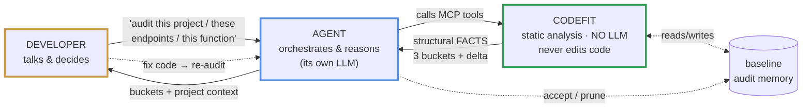
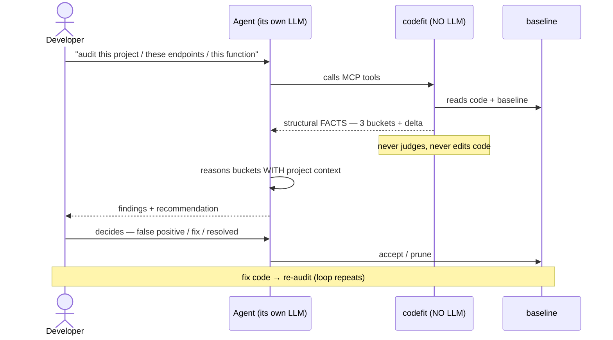

# codefit

[](https://github.com/codefit-cli/codefit/actions/workflows/ci.yml)
[](LICENSE)

> **The MCP-first auditor for AI-generated code — codefit maps, the agent reasons.**

codefit is an open-source tool, written in Go, that audits software written
(partly or fully) by AI. It detects what a developer **never sees** during normal
development: security vulnerabilities, algorithmic complexity that scales badly,
structural database problems, regression risk, and quality issues that only
surface under deep review. Its guiding principle: *codefit audits what the
developer is never going to see* — if a dimension is visible during normal
development, it is out of scope.

## How it works — a collaborative loop, not a linter dump

codefit is not a tool that prints a list of findings. It is one side of a loop
between you, your agent, and codefit — each with a distinct job. **codefit reads
and analyzes (no LLM, never edits code); your agent reasons with its own LLM; you
decide.**

**The three roles — who does what.** Each color marks a role; you will see the
same colors again in the loop below.



The boundary is the whole point: **codefit never calls an LLM.** It runs the
deterministic layers (patterns + AST), maps the structural *surface* of the
classes that need reasoning, and returns **facts** ("reads `params.id`", "no known
authz helper in the body") — never a verdict. The agent you already use supplies
the intelligence, reasoning each item with the project's context. That is what
democratizes auditing: anyone already coding with AI can audit without extra API
keys or infrastructure.

**One full pass through the loop.** Same actors, same order as above — the
developer asks, the agent orchestrates, codefit reports facts, the developer
decides, and a fix re-enters the loop.



## What problem it solves (and what it is NOT)

The agent generates code that **passes the tests** and **meets the visible
criteria**. Nobody sees the rest: a missing ownership check on an endpoint, a model
serialized with every column to the client, a hash that is weak for security, an
index that only hurts at scale. codefit audits exactly that invisible layer.

It **complements** linters and type-checkers — it does not replace them. An unused
`any`, a style nit, an obvious type error are visible during normal development, so
a linter already catches them and they are **out of scope**. codefit is the
independent audit layer that validates AI-generated code is secure and correct
**before** it merges.

## Status — Phase 1 complete (`v0.1.0`)

**Works today, on `main`, validated in real use against a Next.js/Prisma backend:**

- **Providers:** TypeScript (gotreesitter, pure Go) and Go (`go/ast`, used for the
  CI self-audit).
- **Deterministic security rules (TypeScript)** — five categories, each a fact at
  certainty 1.0 (see [COVERAGE.md](COVERAGE.md)).
- **Surface mapping** — three categories (IDOR, broken authorization,
  over-fetching) for Next.js / Prisma, enumerated completely for the agent to reason.
- **`scan-all` three-bucket synthesis** + on-demand `scan-endpoint` detail.
- **Baseline** — a committed, content-addressed memory of the audited surface, with
  `baseline-list` / `-accept` / `-prune`, so a re-scan only surfaces what changed.
- **`codefit init`** — detects the stack, writes `.codefit.yaml`, and installs
  codefit's own thin skill for each detected agent.
- **MCP stdio server** (official MCP Go SDK), single static binary, `CGO_ENABLED=0`.

**On the roadmap (not yet in `main`):** the HTTP/SSE transport; Phase 2 DB sensor;
Phase 3 code review / best practices / tests; Phase 4 knowledge packs + `update`.
See the [PRD](docs/PRD-codefit-v1.4.md) §25 and [VERSIONING.md](VERSIONING.md).

## Install

```bash
go install github.com/codefit-cli/codefit/cmd/codefit@latest   # Go 1.25+
```

A single static binary, no runtime dependencies (`CGO_ENABLED=0`), cross-compiling
to linux/amd64, linux/arm64, windows/amd64, darwin/arm64. There is no LLM or auth
to configure — codefit manages no models and no credentials.

## Quickstart

```bash
# 1. In your project, generate config + install codefit's skill for your agent(s)
codefit init

# 2. Register codefit as an MCP server for your agent (see "Connect codefit" below)

# 3. From your agent, in plain language:
#    "audit the endpoints in this project for IDOR and broken authorization"
```

The agent loads codefit's skill, calls `codefit-scan-all`, reads the three buckets,
reasons the surface with your project's context, and reports back. When you decide
an item is a false positive it calls `codefit-baseline-accept` with your reason;
after a fix it calls `codefit-baseline-prune`. You never leave the agent, and
codefit never touches your code.

## Connect codefit

Register codefit as a local (stdio) MCP server. Use the **absolute path** to the
binary if it is not on the agent process's `PATH`. codefit is stateless — the
project root is passed per call as the `root` tool argument, so the server needs no
`cwd`.

**Claude Code** — `.mcp.json` (project) or `claude mcp add`:

```json
{
  "mcpServers": {
    "codefit": { "command": "/absolute/path/to/codefit", "args": ["mcp", "serve"] }
  }
}
```

**OpenCode** — `opencode.json`:

```json
{
  "mcp": {
    "codefit": { "type": "local", "command": ["/absolute/path/to/codefit", "mcp", "serve"], "enabled": true }
  }
}
```

**Codex** — `~/.codex/config.toml`:

```toml
[mcp_servers.codefit]
command = "/absolute/path/to/codefit"
args = ["mcp", "serve"]
```

Then run `codefit init` in the project. It detects Codex by a **project-local
`.codex/`** dir (not the global config); if Codex is only configured globally,
`init` writes the skill to the standard `.agents/skills/codefit/` location and
tells you so.

## The tools

codefit exposes its capabilities as MCP tools in three roles:

**The engine** — run the analysis and read the result.

| Tool | What it does |
| --- | --- |
| `codefit-scan-all` | The per-endpoint synthesis: three buckets (`actionable` / `resolved_clean` / `frontier_pending`) + the baseline delta. The main entry point. |
| `codefit-scan-endpoint` | Full detail of one file on demand (to follow a `frontier_pending` endpoint). |
| `codefit-scan-security` | The deterministic findings + mapped surface over a project (the flat result). |
| `codefit-surface-idor` / `-authz` / `-overfetch` | Enumerate one surface category for the agent to reason. |

**Baseline** — the project's audit memory (see below).

| Tool | What it does |
| --- | --- |
| `codefit-baseline-list` | List tracked items (fingerprint, file, category, state) — `filter: known` for what's still pending. |
| `codefit-baseline-accept` | Record a human's decision to accept an item (false positive / accepted debt) with a reason. |
| `codefit-baseline-prune` | Drop items a refactor resolved (re-scans to confirm they're gone first). |

**Auxiliary** — feed results back and introspect.

| Tool | What it does |
| --- | --- |
| `codefit-confirm-surface` | Integrate the agent's verdicts: a confirmed item becomes a probabilistic finding anchored to it. |
| `codefit-coverage` | The coverage manifest for a language — what codefit audits vs. reasons over vs. does not cover. |

## The baseline model

The baseline is a committed file (`.codefit-baseline`, repo root — shared knowledge
like `.codefit.yaml`) that records codefit's view of the audited surface, so a
re-scan only surfaces what changed. Key properties:

- **Identity by content, not line.** Each item is fingerprinted by its content
  (category + file + normalized snippet), so moving code does not churn the baseline;
  the item is re-detected only when its content actually changes (ADR 0009).
- **A snapshot of the current state, not an accept-list.** `scan-all` records the
  delta — `new` / `changed` / `known` / `gone` — and acts on what's new; `known`
  surface is silenced but counted (ADR 0010).
- **A safeguard graduated by certainty.** A surface item (a *question*) becomes
  `known` automatically. A deterministic finding (an *affirmation*, certainty 1.0) is
  **never auto-silenced** — it shows on every scan until a human accepts it with a
  reason. Silencing an affirmation is graver than silencing a question (ADR 0011).
- **codefit never edits your code** — only its own baseline file, and only via the
  agent acting on your decision (ADR 0012). The full decision history lives in
  `docs/decisions/`.

## The differentiator: surface mapping

Deterministic rules are what any linter does. The honest **surface mapping** that
the agent reasons over is what makes codefit different. Classes like IDOR, broken
authorization, and over-fetching cannot be caught by a fixed pattern — they need
semantic understanding. So codefit does not mark candidates surgically (inheriting
the AST's blind spot); it **enumerates the complete structural surface** of each
class and hands all of it to the agent, with structural signals that are **facts**
and a reason-to-review that is a **question**. What it cannot confirm locally (the
data left the handler) it hands off at the *frontier*; what it does not cover it
**declares** in [COVERAGE.md](COVERAGE.md). Recorded in
[ADR 0005](docs/decisions/0005-surface-frontier-finite-vs-infinite.md) and
[ADR 0006](docs/decisions/0006-scan-all-endpoint-synthesis.md).

## Principles

- **codefit never touches your code.** It reads code and reads/writes its own
  baseline. Fixes are the agent's and yours, never codefit's.
- **The developer always decides.** codefit informs (`blocked`, the buckets, the
  consequences); it has no power over your git and never accepts an item on its own.
- **Agent-first, no LLM of its own.** codefit returns facts; your agent reasons.
- **Honest about coverage.** What it does not audit is declared, not hidden.

## Supported languages

| Language / Ecosystem | Status |
| --- | --- |
| **Go** | Provider + static security/best-practice detectors. codefit audits itself in CI. |
| **TypeScript / Next.js / Prisma** | Deterministic security rules (5 categories) + surface mapping (IDOR, authz, over-fetching), validated against a real backend. |
| Java / Spring | Roadmap |
| Python / FastAPI / Django | Roadmap |

Adding a language means implementing one `LanguageProvider` — it never touches the
core, the sensors, the MCP server, or the reporting (see
[CONTRIBUTING.md](CONTRIBUTING.md) and `docs/decisions/`).

## Contributing

Contributions are welcome — new rules, surface categories, language providers, and
false-positive reports especially. See [CONTRIBUTING.md](CONTRIBUTING.md) and
[`rules/README.md`](rules/README.md). Please follow our
[Code of Conduct](CODE_OF_CONDUCT.md), and report security issues per our
[Security Policy](SECURITY.md).

## License

[Apache 2.0](LICENSE).
