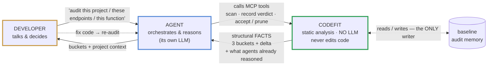
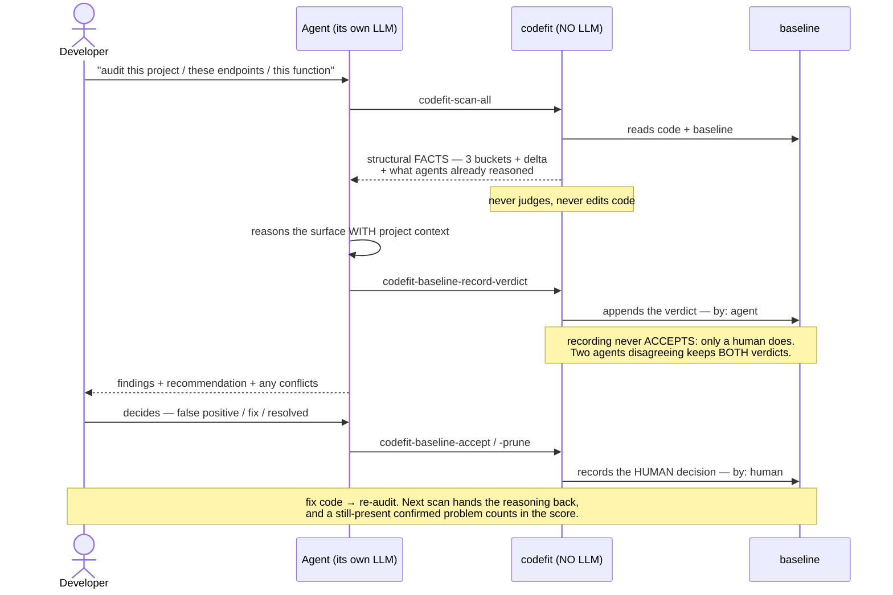

# codefit

[](https://github.com/codefit-cli/codefit/actions/workflows/ci.yml)
[](LICENSE)

> **The MCP-first auditor for AI-generated code — codefit maps, the agent reasons.**

codefit is an open-source tool, written in Go, that audits software written
(partly or fully) by AI. Its guiding principle: *codefit audits what the developer
is never going to see* — if a problem is visible during normal development, it is
out of scope.

**New here?** This page explains the idea from zero. When you are ready to run it,
everything practical lives in the [documentation index](#documentation) below.

---

## The problem

A huge share of code is now written with AI assistance. That code **compiles,
passes its tests and looks correct** — and often is. The trouble is the code that
*looks* right and carries a hole nobody is looking at:

```ts
// GET /api/orders/[id] — returns an order
export async function GET(req, { params }) {
  const order = await db.order.findUnique({
    where: { id: params.id }
  });
  return Response.json(order);
}
```

This works. Tests pass. The linter is silent — correctly, because **there is no
programming error here**. And yet:

- **Anyone can fetch anyone's order** by changing the number in the URL — nothing
  checks the order belongs to the caller.
- **Nothing checks the caller is even logged in.**
- **The whole record is returned**, including fields the client may never have
  been meant to see.

A linter finds errors of *form*; a test checks the code does what it says — and it
does. What is missing here is **an absence**, and an absence cannot be caught by a
rule that looks for presences. That is the gap codefit exists for.

## The idea: split the work

Two very different jobs are tangled in that example:

- **The mechanical job** — walk 400 files and find *every* place where a
  client-supplied identifier reaches a database query. Exhaustive, boring, and a
  machine does it better than any person.
- **The judgment job** — look at one such place and decide whether the filter that
  is there actually guarantees ownership. That takes understanding of the business
  and the project's conventions.

codefit's whole architecture follows from keeping those apart. **It does the
mechanical job exhaustively, and hands the judgment job to something that can
reason**: the AI agent you already work with (Claude Code, Cursor, and any other
MCP-capable assistant).



The boundary is the whole point: **codefit never calls an LLM.** It runs
deterministic analysis, maps the structural *surface* of the classes that need
reasoning, and returns **facts** — never a verdict. The agent you already use
supplies the intelligence, with your project's context in front of it. That is
what makes auditing free to run: no API key, no per-scan cost, no infrastructure.

## What it affirms, and what it asks

Everything codefit returns is one of two things, and it never blurs them:

- **A finding** is something codefit **affirms**, at full certainty — a conclusion
  visible in one local piece of code, like a credential-named variable holding a
  hardcoded string. Findings score, and they are never silenced automatically.
- **A surface item** is something codefit **asks**. It marks a place where a
  problem *may* exist — like the order endpoint above — and states the syntactic
  facts around it (*"reads `params.id`"*, *"no known authorization helper detected
  in the body"*), never a judgment. Deciding is the agent's job, with the item's
  facts in hand.

The rule separating them is a single question: **is the conclusion complete inside
this piece of code, or would you have to go look somewhere else?** What is
complete gets affirmed. What is not gets asked — and asked *completely*: the
surface is enumerated in full, never sampled, because a question codefit forgets
to ask is a blind spot the agent will never know to look into.

When in doubt, codefit over-reports: a spurious question costs the agent a
glance, while a missed one is a false all-clear — and a false all-clear is the
one thing an auditor must never produce.

## How a scan actually runs



A scan is a funnel of four layers, each cheaper than the next, each allowed to
conclude less than the one after it: **scope** (only the files you touched are
analysed — but everything is still *counted*, so a partial scan can never flatter
itself), a language-agnostic **text layer** for obvious credential shapes, the
**structural layer** where the syntax tree yields findings and surface — and
**reasoning**, which is not codefit at all: it is the agent, working on exactly
what the cheaper layers could not settle.

The response comes back grouped by endpoint, in three buckets: **actionable**
(codefit resolved it locally and a control is missing — act here),
**resolved clean** (codefit looked and the controls are present — an affirmation,
not a leftover bucket), and **frontier** (the data left the file; the agent
follows it). Every response declares its own byte budget and says exactly what
was withheld, so a cut list can never be mistaken for a complete one.

## The memory the project keeps

Audit results live in a committed file — team knowledge, not one machine's. Each
item is identified by a hash of its **content**, so moving code changes nothing
and editing it makes stale knowledge expire on its own. Three tiers, guarded by
certainty:

- a **question** goes quiet by itself after the first sighting;
- an **affirmation** never does — it shows on every scan until a *human* accepts
  it, with a written reason, committed next to the code;
- an **agent's verdict** is recorded, always marked as the agent's, and silences
  **nothing**. Two agents that disagree keep *both* verdicts, and the item is
  raised as a conflict for a human. A confirmed problem that is still present in
  the code counts against the score on the next scan — so the number reflects
  what was actually reasoned, not only what codefit affirms alone.

The agent recommends. The human decides. That asymmetry is the whole design.

## What it deliberately never does

- **Never calls a language model.** No API key, no account, no per-scan cost.
- **Never edits your code.** The only file it writes is its own memory.
- **Never touches your git.** It can report that something is blocking; whether
  that stops a commit is your policy, not the tool's power.
- **Never decides for you.** Accepting anything requires a human and a written
  reason, recorded with who and when.
- **Never claims "clean" about something it did not verify.** An unsupported
  language gets an error, not an empty report that looks like approval.

Every refusal buys the same thing: when codefit says it found something, it found
it — and when it says nothing, it is because it looked and there was nothing, not
because it could not look and stayed quiet.

## Status, honestly

Two of the five dimensions codefit is scoped to audit ship today: **security**
(TypeScript with all four surface categories; Go with a narrower, declared reach)
and **database structure** (any language that declares a schema — the parser
resolves by the schema file's shape, not by your app's language). The rest is
scope, not capability, and every limit is written down where both you and the
agent can read it. The full picture, with the measurements behind it, is one
click below.

## Documentation

| Guide | What you will find |
| --- | --- |
| **[Getting started](docs/guide/getting-started.md)** | Install, verify the binary, connect it to your agent, first audit. **Read this before grabbing a release** — the "latest" shortcut on GitHub currently points at an older build. |
| **[Languages & reach](docs/guide/languages.md)** | Exactly which languages and dimensions run today, per-category reach, and what has actually been measured against real projects. |
| **[Tools reference](docs/guide/tools.md)** | Every MCP tool, scoping a scan to changed files, and the opt-in finding cache. |
| **[COVERAGE.md](COVERAGE.md)** | Every declared limit, per rule — the honest "what it does NOT see", mirroring the manifest the agent itself reads. |
| **[Roadmap](docs/roadmap.md)** | Where the project is going, ordered by user harm, not by shine. |
| **[Architecture decisions](docs/decisions/)** | One ADR per decision, append-only — the why behind everything above. |
| **[CHANGELOG.md](CHANGELOG.md)** | What actually shipped, release by release. |

## Contributing

Contributions welcome — see [CONTRIBUTING.md](CONTRIBUTING.md). The bar to know
in advance: strict TDD (every control proven by mutation), and documentation that
states only what `main` does today.

## License

[Apache 2.0](LICENSE).
